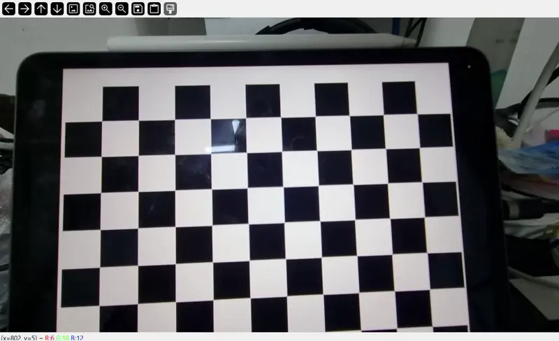
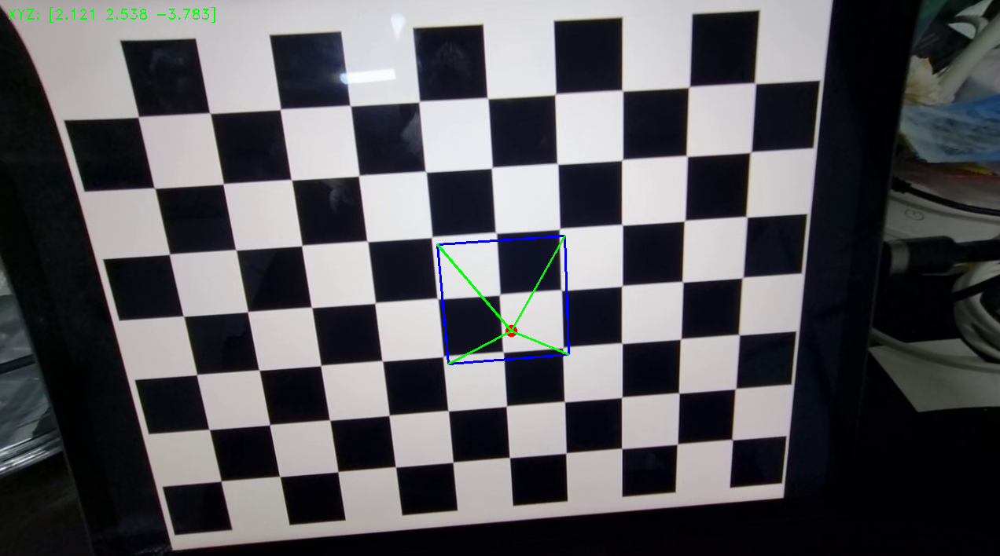
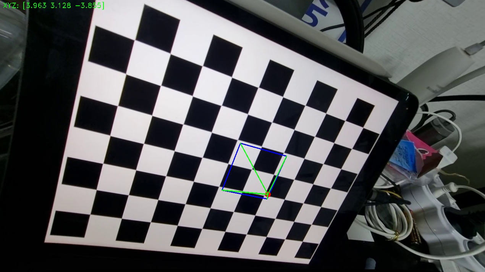

# AR Tutorial: Pyramid Appears

## Principle

1. [`image_calibration.py`](https://github.com/jundoopop/computer-vision-fundamentals/blob/main/camera-calibration-learning/image_calibration.py) detects grids and measures distortions and errors.

2. Generate a pyramid on the pyramid, when the coordinates as the space is detected. [`draw_pyramid.py`](https://github.com/jundoopop/computer-vision-fundamentals/blob/main/ar-tutorial-on-board/draw_pyramid.py) does it.

### Sample Video



## Camera Calibration Results

### From [`calibration_results.json`](https://github.com/jundoopop/computer-vision-fundamentals/blob/main/camera-calibration-learning/calibration_results.json)

```json
{
  "camera_calibration_results": {
    "number_of_selected_images": 4,
    "rms_error": 0.9408847686898631,
    "camera_matrix": [
      [618.5875582240405, 0.0, 646.839113411426],
      [0.0, 616.8772250191329, 368.33639601179175],
      [0.0, 0.0, 1.0]
    ],
    "distortion_coefficient": [
      -0.019261673891855926, 0.07547854507909078, 0.0004665137033709962,
      -0.0007320630681497287, -0.07019899788292756
    ]
  }
}
```

### Comprehension

- The number of selected images = 7
- RMS error = 0.7588054458700894
- Camera matrix (K) =

```python
np.array(
    [
        [612.26865008, 0.0, 643.2243679],
        [0.0, 611.58145865, 363.62122411],
        [0.0, 0.0, 1.0],
    ],
)
```

### Captures


