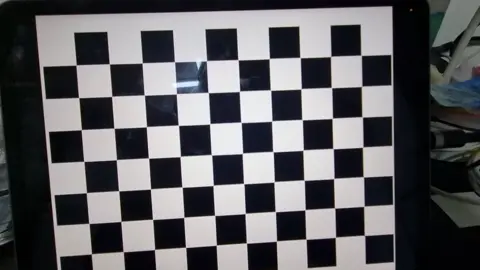
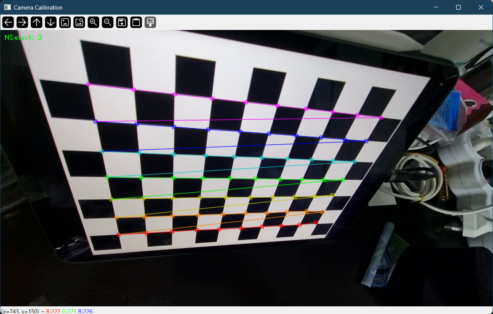
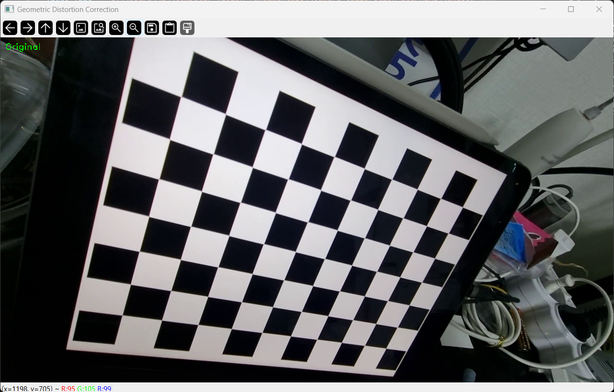
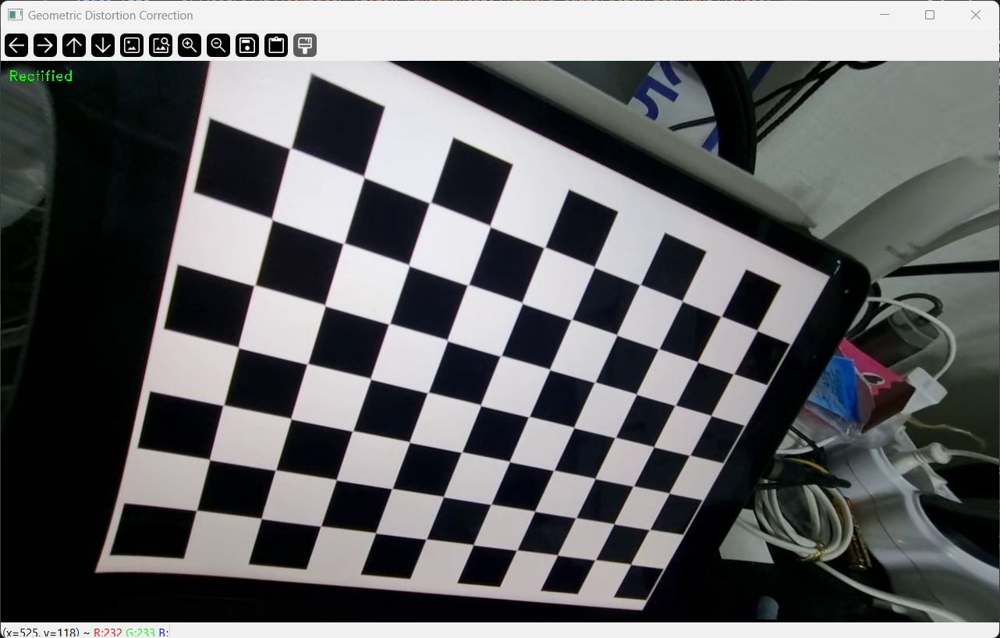
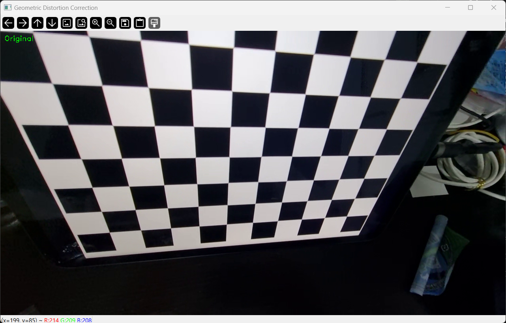
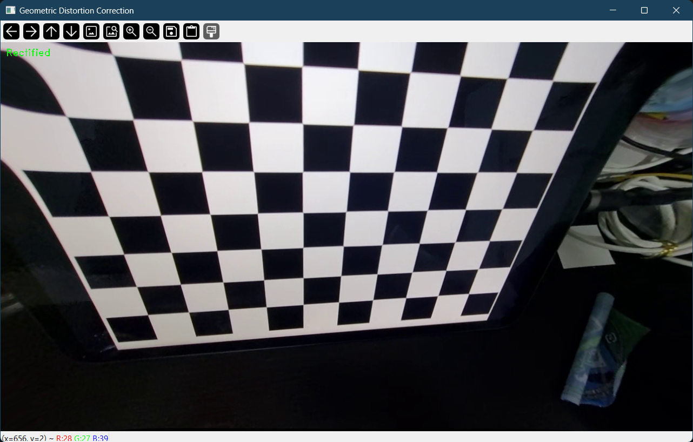

# Distortion & Calibration of the Perspection

This program [`image_calibration.py`](https://github.com/jundoopop/computer-vision-fundamentals/blob/main/camera-calibration-learning/image_calibration.py) detects grids and measures distortions and errors.

### Sample Video



## Camera Calibration Results

### You can check it in your terminals, when you execute it

* The number of selected images = 7
* RMS error = 0.7588054458700894
* Camera matrix (K) =

```python
np.array(
    [
        [612.26865008, 0.0, 643.2243679],
        [0.0, 611.58145865, 363.62122411],
        [0.0, 0.0, 1.0],
    ],
)
```

* Distortion coefficient (k1, k2, p1, p2, k3, ...) =

```python
np.array(
    [-0.03120115, 0.13887876, 0.00036394, -0.00187562, -0.13854699],
)
```

### Calibartion Result



### Correction Result

[`distortion_correction.py`](https://github.com/jundoopop/computer-vision-fundamentals/blob/main/camera-calibration-learning/distortion_correction.py) applies callibration results toward the video and show the fixed version of photo.

| Orignals                             | Rectified Version                        |
| -------------------------------------| ---------------------------------------- |
|  |   |
|  |   |
-----------------------------------------------------------------------------------
