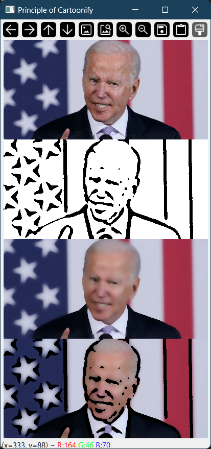
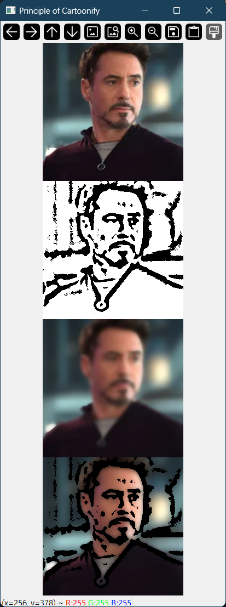

# Cartoon Image Generator

[Cartoonify an Image with OpenCV in Python](https://data-flair.training/blogs/cartoonify-image-opencv-python/)

This webpage explains how to make an image of cartoon feeling photos from the real world photos.

## Principle

### 1. Set an original image

Choose an original image to apply an algorithm

### 2. Greyscale a sample image

Greyscale an original image for edge detecting.

### 3. Retrieving the edges of an image

Allocate another image to contain an edge to make an outline of the objects in photo.

### 4. Preparing a mask image

By masking, we could combine the edge and the smooth version of the image.

Apply a bilateral filter to the original and make a smoother, which has more similar colour value distributions between pixels.

### 5. Giving a cartoon effect

Executing `cv2.bitwise_and` make a cartoonified image by combining the edge and the blurred image.

## Examples

| Good Example                | Bad Example                      |
| ----------------------------| -------------------------------- |
|    |        |
| Edges are well detected     | Edges are detected too much      |
-----------------------------------------------------------------

### Analyse the Examples

- Edge detection detects not only the face or the primary object, it detects under the condition of brightness difference between the pixels.

- The good example has simple background, so the edge was detected clearly.
- In contrast, the edge was detected in many points.

### Beyond the limitations of this algorithm

- Classification or segmentation should be needed
  - Because it should distinguish the objects and some bothering edges should be removed

- Colour unificiations should be recommended
  - Both examples look like real-photo, rather than the cartoon image.
